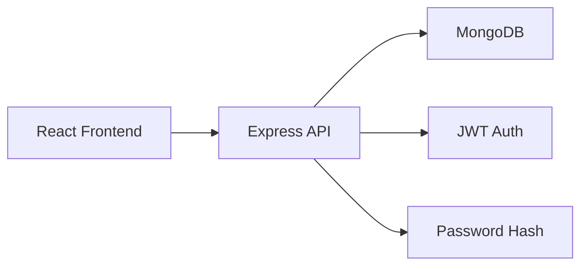

<div align="center">

# 🚀 MERN Authentication System

### A robust authentication solution built with the MERN stack

[](https://www.mongodb.com/)
[](https://expressjs.com/)
[](https://reactjs.org/)
[](https://nodejs.org/)
[](https://jwt.io/)
[](https://tailwindcss.com/)

</div>

## ⭐ Key Features

- 🛡️ **Enterprise-grade Security**
    - JWT-based authentication
    - Bcrypt password hashing
    - Protected routes & middleware
- 🎯 **Modern Architecture**
    - React Context API for state management
    - RESTful API design
    - MongoDB with Mongoose ODM
- 💅 **Polished UI/UX**
    - Responsive Tailwind CSS design
    - Dynamic navigation
    - Loading states & error handling

## 🏗️ Architecture



## 🚀 Quick Start

1. **Clone & Install**
```bash
git clone https://github.com/SudilPaudel/PRODIGY_FD_01
```

2. **Configure Environment**
```bash
# /server/.env
MONGO_URI=your_mongodb_uri
JWT_SECRET=your_secret_key

```

3. **Launch**
```bash
# Backend
cd server && npm run dev

# Frontend
cd client && npm run dev
```

## 📡 API Reference

| Endpoint | Method | Auth Required | Description |
|----------|--------|---------------|-------------|
| `/api/auth/register` | `POST` | No | Create account |
| `/api/auth/login` | `POST` | No | Get auth token |
| `/api/auth/me` | `GET` | Yes | Get user data |

## 🧪 Development

```bash
├── client/                # React SPA
│   ├── src/
│   │   ├── components/   # Reusable UI
│   │   ├── pages/       # Route components
│   │   └── utils/       # Utilities
│
└── server/               # Express API    
        ├── models/         # Data schemas
        └── middleware/     # Auth checks
```

## 🤝 Contributing

1. Fork it
2. Create feature branch (`git checkout -b feature/thing`)
3. Commit changes (`git commit -am 'Add thing'`)
4. Push to branch (`git push origin feature/thing`)
5. Open Pull Request

## 📝 License

 © [Sudil Paudel]

---

<div align="center">
    
### Built with ❤️ during my internship at Prodigy Infotech

[Live Demo](https://prodigy-fd-01-3.onrender.com/) | [Report Bug](https://github.com/SudilPaudel/PRODIGY_FD_01/issues)

</div>

